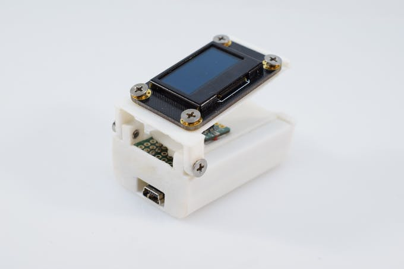

# Project description

To DOWNLOAD all files [CLICK HERE](https://github.com/CombatCovid/Pulse-Oximeter-Arduino/archive/master.zip) 

To visit our repo [CLICK HERE](https://github.com/CombatCovid/Pulse-Oximeter-Arduino)

## The Challenges of COVID-19

COVID-19 is a disease caused by the SARS-CoV-2 virus that primarily attacks a person's respiratory system. Some milder symptoms can include fever, aches, and chills, but it can also lead to more serious conditions such as pneumonia. A person who has pneumonia or even slight shortness of breath might not know when to go to a hospital, especially as they start to get even more overwhelmed. This is why I created this open source pulse oximeter, which can assist in getting people the help they need and get accurate information about their current condition.

## A Bit of a Disclaimer

This device/project is not to be used as an accurate medical diagnostic tool!