# Steps to build the device

##  Print Out and Clean Parts

- Begin by downloading each piece from the attachment section on this project and loading it into your slicer of choice. 
- I used an infill of around 70-80% and medium supports, all with PLA. 
- After they were done printing, I removed the supports and did some light sanding to ensure they all fit together nicely.

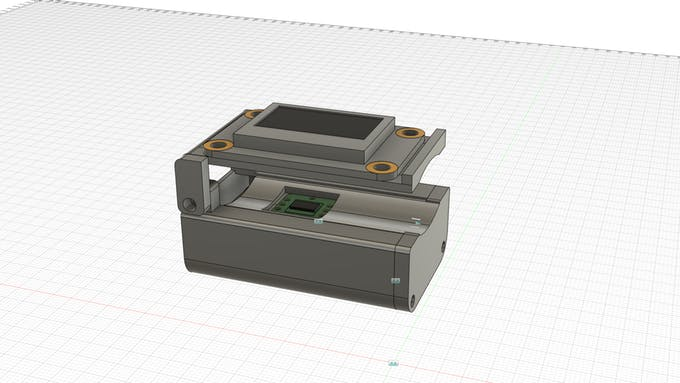

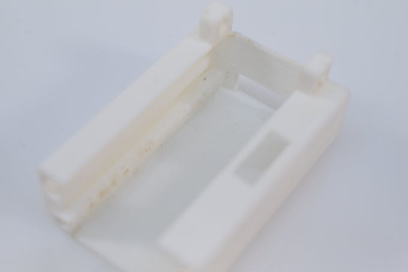

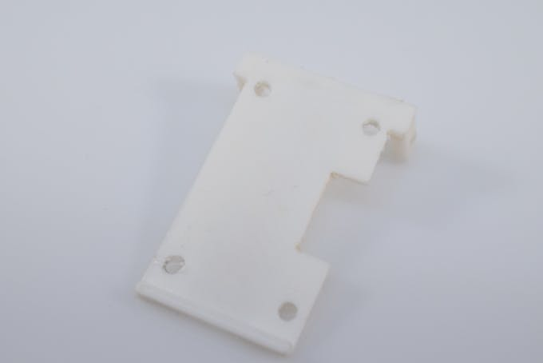

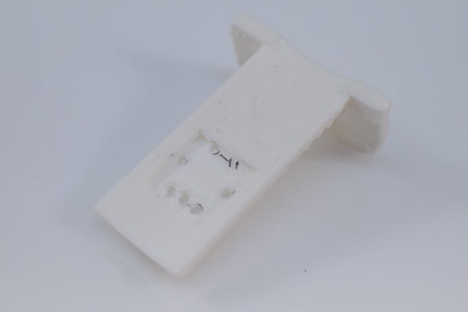

##  Solder the Electronics

- The entire device is designed around an Arduino Nano that is mounted on a piece of 44mm by 30mm perfboard. 
- First, wires get soldered to the VIN, GND, SDA, and SCL pins of the sensor and then run underneath the bed piece to the Arduino Nano.

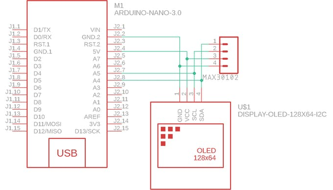

- Next, the connector for the OLED is attached to the Nano and then run up to the display itself.

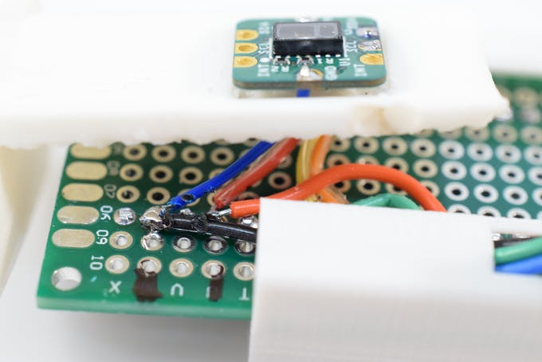

- And finally, the entire electronics assembly is slid into the housing and secured with a couple of 3mm screws.

## Assemble the Device

- After the electronics have been inserted, simply attach the OLED screen to the top piece and secure it to the rest of the chassis with a couple of 3mm screws.
-  You can test its motion by gently articulating the lid up and down.

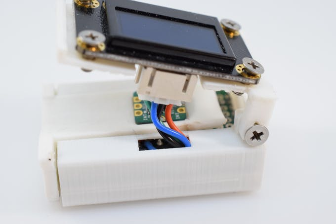

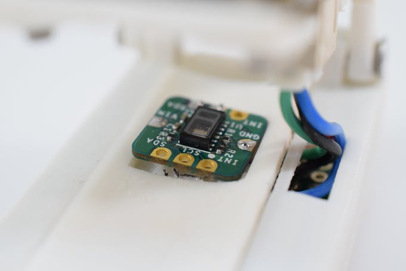

##  Uploading the Sketch

- The included sketch performs a couple of actions to display the user's current heartrate and oxygen saturation. 
- To upload it, simply install the required libraries and select Arduino Nano from the board list in the Tools menu and click Upload.

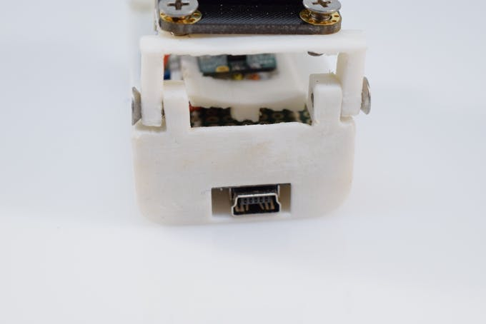

- As for the sketch itself, it first initializes the OLED and MAX30102, whilst reporting any errors that might arise. [See the code here](../../src/pulse_oximeter_code.c) 
- Next, it reads in 100 values to calibrate the sensor and begins displaying them. The device then enters a loop where it reads in 25 new values and computes a moving average with them. 
- Finally, it checks if the values are valid and prints them to the screen if they are.

## Using It

- To use the pulse oximeter, place your fingertip over the sensor and gently close the top lid. 
- Then plug in a power source and simply wait until you see data being displayed.

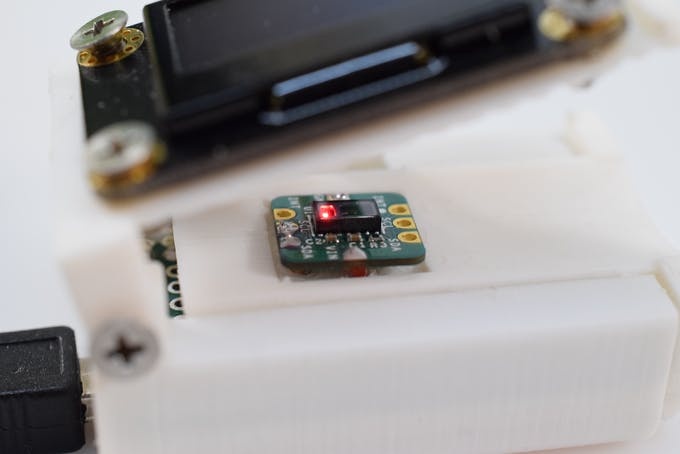

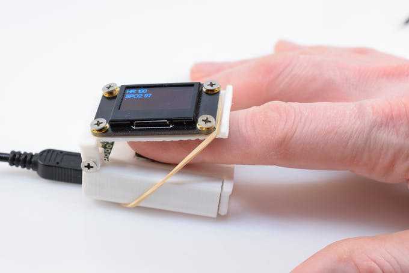

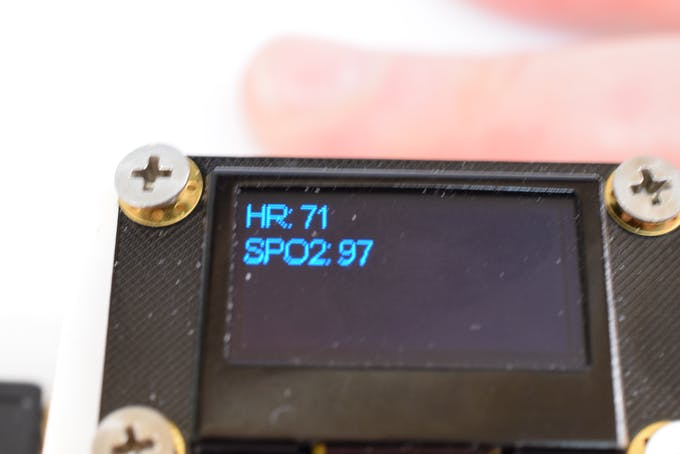

