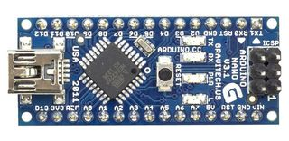
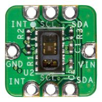
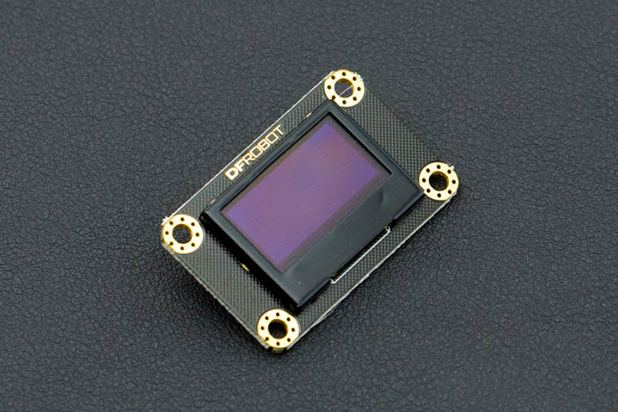

# Items 

- Development Board, Arduino Nano, ATmega328 MCU, 14 3.3V I/O, 6 PWM Outputs, USB Mini B

    - Image:
 
        

    - Amount: 1
    - Reference to buy it : [https://www.newark.com/arduino/a000005/dev-board-atmega328-arduino-nano/dp/13T9275?COM=ref_hackster](https://www.newark.com/arduino/a000005/dev-board-atmega328-arduino-nano/dp/13T9275?COM=ref_hackster)

- Reference Design Board, Pulse Oximeter & Heart Rate Monitor, MAX30102, MAX14595, MAX1921

    - Image:

        

    - Amount : 1
    - Reference to buy it : [https://www.newark.com/maxim-integrated-products/maxrefdes117/ref-des-brd-heart-rate-pulse-oximeter/dp/96Y9339](https://www.newark.com/maxim-integrated-products/maxrefdes117/ref-des-brd-heart-rate-pulse-oximeter/dp/96Y9339)

- Gravity I2C OLED-128x64 Display

    - Image : 

        

    - Amount : 1
    - Reference to buy it : [https://www.dfrobot.com/product-1576.html](https://www.dfrobot.com/product-1576.html)

## Necessary tools and machines

    - A generic 3D printer
    - A generic soldering iron 

## Apps and Online Services 

 - [Arduino Software](https://www.arduino.cc/en/main/software)

 - [Autodesk Fusion 360](https://www.autodesk.com/products/fusion-360/overview?mktvar004=1028744&internalc=true)